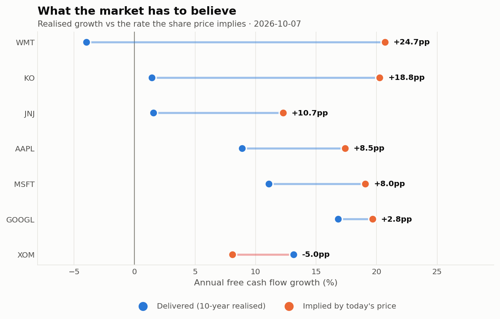

# What does the market have to believe?

**A reverse DCF on eight US large caps, built directly from SEC filings.**


## The finding

Seven of eight are priced for faster free cash flow growth than they have delivered over a
decade. The exception is Exxon.

| | Implied g | Realised g | Gap |
|---|---:|---:|---:|
| **WMT** | 20.7% | −4.0% | **+24.7pp** |
| **KO** | 20.3% | 1.4% | **+18.8pp** |
| **JNJ** | 12.3% | 1.6% | +10.7pp |
| **AAPL** | 17.4% | 8.9% | +8.5pp |
| **MSFT** | 19.1% | 11.1% | +8.0pp |
| **GOOGL** | 19.7% | 16.8% | +2.8pp |
| **XOM** | 8.1% | 13.1% | **−5.0pp** |

*Prices as of 2026-10-07. Nvidia is shown in the note but has too little usable history for a gap.*

The gap is widest where the business is slowest. The names usually called defensive carry
the most demanding expectations relative to their own record, while Alphabet — which has
genuinely compounded at 16.8% — is asked for 19.7%, a gap of under three points.

📄 **[Read the research note](notes/research-note.md)**



---

## Why run a DCF backwards

A forward DCF takes a growth assumption and produces a value. Every input is a judgement,
the output is one number with a currency sign in front of it, and the arithmetic confers
an authority the assumptions have not earned. Change growth by two points and the answer
moves by a third.

Backwards, the same machinery asks a better question: **given what the market is paying,
what growth does that price already imply?** That can be set against what the company
actually delivered. It is not a valuation and not a recommendation — it is what you would
have to believe, which is checkable against the record in a way a price target is not.

## Three things that keep it honest

**One discount rate for all eight companies.** A per-company WACC is more defensible in a
real engagement and is also the easiest lever to quietly tune. One rate plus the full
sensitivity grid is the better trade — and the grid shows Apple's implied growth running
from 11.9% to 22.0% across discount rates any analyst might defend. The grid is the
result; the point estimate is one cell of it.

**Free cash flow is cash from operations less capital expenditure.** Not "adjusted", not
before some category of spending the company would rather you ignored. That definition
flatters the technology names via stock-based compensation, but an inconsistent definition
across a comparison table is worse than a generous one applied uniformly.

**The terminal share is reported for every company.** It runs 60–74% here. A model in
which three-quarters of the answer comes from a perpetuity formula is not forecasting a
business, and the reader deserves to know that before being shown a number. It is the most
useful diagnostic a DCF produces and the one most often omitted.

---

## Data: straight from EDGAR

Financials come from SEC XBRL company facts, cached as raw JSON. Nothing passes through a
data vendor, so every figure traces back to a filing. Only the current share price comes
from elsewhere, and it is stored with its date.

XBRL is messier than it looks, and three bugs here produced **well-formed but wrong**
answers rather than errors — each found by sanity-checking against known figures:

| Problem | What it did |
|---|---|
| **Tag changes mid-history** | Nvidia reports capex as `PaymentsToAcquirePropertyPlantAndEquipment` until 2012 and `PaymentsToAcquireProductiveAssets` from 2022. Taking the first concept with data picked the three-year stub — an FCF history wrong by two orders of magnitude ($0.6B against an actual $61.5B). Concepts are now merged across the full history. |
| **52/53-week fiscal calendars** | Johnson & Johnson's fiscal 2009 ended on **2010-01-03**. Labelling by calendar year invented a gap at 2009 and a duplicate at 2012, turning a contiguous 19-year history into a 3-year one. |
| **Genuine holes** | Nvidia has no standard-tagged capex concept at all between 2013 and 2021. Merging recovers both ends but cannot invent the middle, so only the contiguous recent run is kept and the company is reported as having too little history rather than spanning the gap. |

One more, for anyone else pulling from EDGAR: **SEC returns 403 for any User-Agent
containing a URL** — a natural thing to put in one. `"LCS3002 reverse-dcf research script"`
works; the same string with a GitHub link appended does not.

## Tests

```bash
pip install -r requirements-dev.txt
pytest -q
```

37 tests, no network required. The valuation arithmetic is checkable rather than merely
plausible: at zero growth and zero terminal growth the model collapses to exactly `FCF/r`
whatever the horizon, which catches any error in the discounting, the terminal formula or
the first-year offset. The reverse solve is round-tripped against the forward model at six
growth rates — each could be internally consistent while disagreeing with the other.
Every filing-extraction case is a real failure found against real filings.

## Running it

```bash
pip install -r requirements.txt
python -m valuation.run      # filings, results.json, both exhibits
```

Filings are cached, so only the first run touches SEC. Prices are cached by date, so every
figure in one run refers to the same moment.

```
valuation/
├── config.py       # every assumption, fixed a priori
├── edgar.py        # SEC XBRL client, concept fallback chains, caching
├── financials.py   # FCF history, net debt, share count, fiscal-year handling
├── dcf.py          # forward DCF and the bisection solve for implied growth
├── market.py       # current prices, cached with their date
├── exhibits.py     # growth gap, sensitivity grid
└── run.py
```

## Background

This replaces an earlier script that fit a regression to data it generated itself and then
printed a "90% confidence interval for valuation" reflecting only input-shock variance.
The circularity was the design rather than a bug, so it was rebuilt on real filings. What
is reported here is **parameter sensitivity**, explicitly not a confidence interval.
