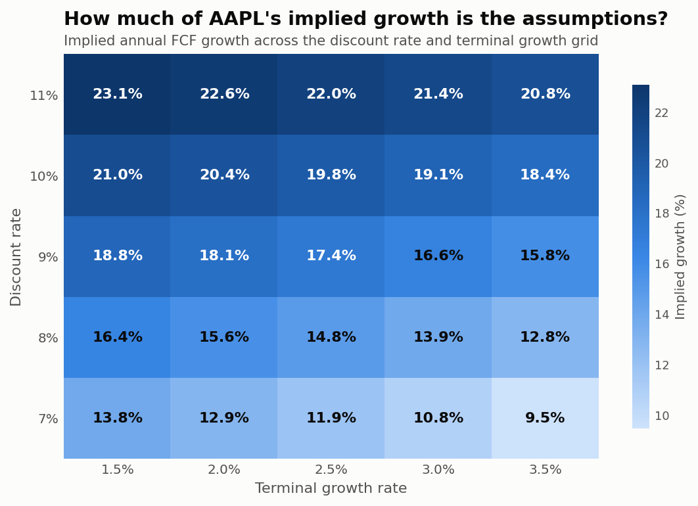

# What does the market have to believe?

**A reverse DCF on eight US large caps, built from SEC filings.**

Lorenz Huber · prices as of **2026-10-07** · [github.com/LCS3002/reverse-dcf](https://github.com/LCS3002/reverse-dcf)

> Every figure here comes from `results/results.json`, regenerated by `python -m valuation.run`.
> Financials are pulled from SEC EDGAR XBRL; nothing passes through a data vendor.

---

## Summary

Seven of these eight companies are priced for faster growth than they have delivered over
the past decade. The exception is Exxon.

The gap is widest where the business is slowest. Walmart's share price implies **20.7%**
annual free cash flow growth from a company whose FCF has *shrunk* 4.0% a year;
Coca-Cola's implies **20.3%** against 1.4% delivered. Alphabet — which has actually
compounded FCF at 16.8% — is asked for 19.7%, a gap of under three points.

That inversion is the finding. The names usually described as defensive carry the most
demanding expectations relative to their own history, while the one that has genuinely
compounded is priced close to what it has done.

**This is not a valuation and not a recommendation.** A reverse DCF does not say what a
company is worth. It says what you would have to believe to pay today's price — which is
checkable against the record in a way a price target is not.

---

## Method

Rather than forecast cash flows and produce a target price, the model is run backwards:
hold the price fixed and solve for the growth rate that reconciles it.

```
EV  =  Σ(t=1..10) FCF₀(1+g)ᵗ / (1+r)ᵗ  +  TV / (1+r)¹⁰
TV  =  FCF₀(1+g)¹⁰ × (1+gₜ) / (r − gₜ)
```

Equity value is EV less net debt; per share, that over the share count. Bisection then
solves for the `g` that makes per-share value equal the market price.

| Assumption | Value | Why |
|---|---|---|
| Discount rate | 9% | Long-run US large-cap equity cost of capital |
| Terminal growth | 2.5% | Below long-run nominal GDP — nothing outgrows the economy forever |
| Explicit forecast | 10 years | |
| FCF base | 3-year average | One year moves materially on a single capex cycle |
| Realised growth | 10 years, both ends smoothed | A CAGR between two single years is mostly a statement about those two years |

**The discount rate is deliberately uniform across all eight companies.** A per-company
WACC would be more defensible in a real engagement, and it is also the easiest lever to
quietly tune until a number comes out nicely. One rate plus a full sensitivity grid is the
more honest trade.

Free cash flow is cash from operations less capital expenditure — no "adjusted" variant and
no exclusions. Stock-based compensation stays as the non-cash add-back the cash flow
statement makes it, which flatters the technology names. The alternative is per-company
judgement calls, and one consistent definition is more useful in a comparison than eight
tailored ones.

---

## Results

| | Price | Mkt cap | Base FCF | × FCF | Implied g | Realised g | Gap | Terminal |
|---|---:|---:|---:|---:|---:|---:|---:|---:|
| **WMT** | 107.20 | 0.85T | 14.2B | 60× | 20.7% | −4.0% | **+24.7pp** | 71% |
| **KO** | 86.17 | 0.37T | 6.6B | 56× | 20.3% | 1.4% | **+18.8pp** | 70% |
| **JNJ** | 254.78 | 0.61T | 19.3B | 32× | 12.3% | 1.6% | +10.7pp | 64% |
| **AAPL** | 333.63 | 4.93T | 102.4B | 48× | 17.4% | 8.9% | +8.5pp | 68% |
| **MSFT** | 529.30 | 3.93T | 70.9B | 55× | 19.1% | 11.1% | +8.0pp | 69% |
| **GOOGL** | 347.68 | 4.20T | 71.8B | 59× | 19.7% | 16.8% | +2.8pp | 70% |
| **XOM** | 164.48 | 0.69T | 29.3B | 23× | 8.1% | 13.1% | **−5.0pp** | 60% |
| NVDA | 239.24 | 5.81T | 61.5B | 95× | 26.4% | n/a | n/a | 74% |


### Exxon is the only one priced below its record

At 23× free cash flow, Exxon's price implies 8.1% growth against 13.1% delivered — the
only negative gap in the set.

The caveat matters more here than anywhere else: a ten-year FCF CAGR for an oil major is
largely determined by where the oil price sat at each endpoint. The window starts in 2016,
near a cyclical trough, which flatters the realised figure. This is the one line in the
table I would not rely on without a longer window and a through-cycle normalisation.

### The defensive names carry the most demanding expectations

Walmart and Coca-Cola imply ~20% growth against roughly nothing delivered. Two things are
going on, and only one of them is about expectations.

**Walmart's free cash flow is suppressed by deliberate investment.** Heavy spending on
automation and e-commerce fulfilment runs through capital expenditure, so a mechanical
CFO-minus-capex base penalises the company for the investment the market is paying for.
The implied growth is real, but part of the measured gap comes from treating that
investment as a permanent drag.

**Coca-Cola's base is distorted by a one-off.** Its 3-year average FCF of $6.6B is
depressed by a large IRS deposit, against a more typical $9–10B. Re-based nearer $9.5B,
the implied growth falls to roughly 15% rather than 20.3% — still well above the 1.4% it
has delivered, but a materially different number.

That is the central limitation of mechanical extraction: **the model cannot distinguish an
unusual year from a trend.** Smoothing over three years reduces the problem without solving
it, and the table should be read with that in mind.

### Most of every valuation sits past the forecast horizon

The terminal value accounts for **60% to 74%** of enterprise value in every case. Ten
years of explicit forecasting is a minority of the answer everywhere, and at Nvidia's 74%
it contributes little.

This is the diagnostic most often left out of a DCF, and it is a warning about the method
rather than about these companies. When three-quarters of the answer comes from a
perpetuity formula, the model is largely restating an assumption about the discount rate.

### Nvidia cannot be assessed here

Nvidia has no standard-tagged capital expenditure concept in its XBRL filings between 2013
and 2021. Merging across tag changes recovers both ends of the history but cannot invent
the middle, so only five contiguous years survive — not enough for a ten-year realised
growth rate. Its 26.4% implied figure is shown, its gap is not.

---

## How much of this is the assumptions?



Apple's implied growth is 17.4% at a 9% discount rate and 2.5% terminal growth. Holding
terminal growth fixed and moving only the discount rate across a range any analyst might
defend gives **11.9% at 7% and 22.0% at 11%** — the implied figure nearly doubles on an
assumption nobody can observe. The point estimate in the table is one cell of this grid.

A conventional DCF presents the point estimate and relegates the grid to a sensitivity
appendix. Here the grid is the result. The defensible claim is not "Apple's price implies
17.4% growth" but "under a reasonable range of assumptions, somewhere between 11.9% and
22.0%".

---

## What this cannot tell you

- **It is not a recommendation.** A high implied growth is not a sell signal. It may be
  entirely achievable — Nvidia's 26.4% would have looked absurd in 2019 and been far too
  low. The output is a question, not an answer.
- **One discount rate for eight companies.** Deliberate, for the reason given above, but
  it means a volatile business is not discounted more heavily than a stable one.
- **FCF is not normalised.** No adjustment for working-capital swings, one-off tax
  settlements or investment cycles. Coca-Cola and Walmart show what that costs.
- **Eight companies is not a sample.** This is a demonstration of a method on a handful of
  names, not a cross-sectional study. Nothing here supports a claim about the market.
- **Prices are from one day.** Every implied figure moves with the price. The date is on
  the first line for that reason.
- **Survivorship.** These are eight large, successful companies chosen for recognisability
  and clean filings. The method's behaviour on distressed or loss-making companies — where
  base FCF is negative and implied growth undefined — is untested.

---

## What I would do next

**Normalise free cash flow properly.** The Coca-Cola and Walmart cases show the mechanical
base is the weakest part. Separating maintenance from growth capital expenditure, and
flagging one-off tax and working-capital items, would do more for the result than any
refinement of the discount rate.

**Widen to a full index and look at the distribution.** With eight names the gap column is
anecdote. Across five hundred, "what is the market asking of this company relative to its
own history" becomes a cross-sectional signal that can be tested against subsequent
returns — which is where this connects to the kind of work in
[rsi-sentiment-study](https://github.com/LCS3002/rsi-sentiment-trading-study).

**Back-test the implied figure.** The honest test of whether any of this means anything:
did companies with large positive gaps subsequently underperform? That is answerable with
the same machinery and historical prices, and it would turn a demonstration into a study.

---

## Reproducing this

```bash
pip install -r requirements.txt
python -m valuation.run     # pulls filings, writes results.json and both exhibits
pytest -q                   # 37 tests, no network required
```

Filings are cached, so only the first run touches SEC. Prices are cached by date, so every
figure in one run refers to the same moment.
